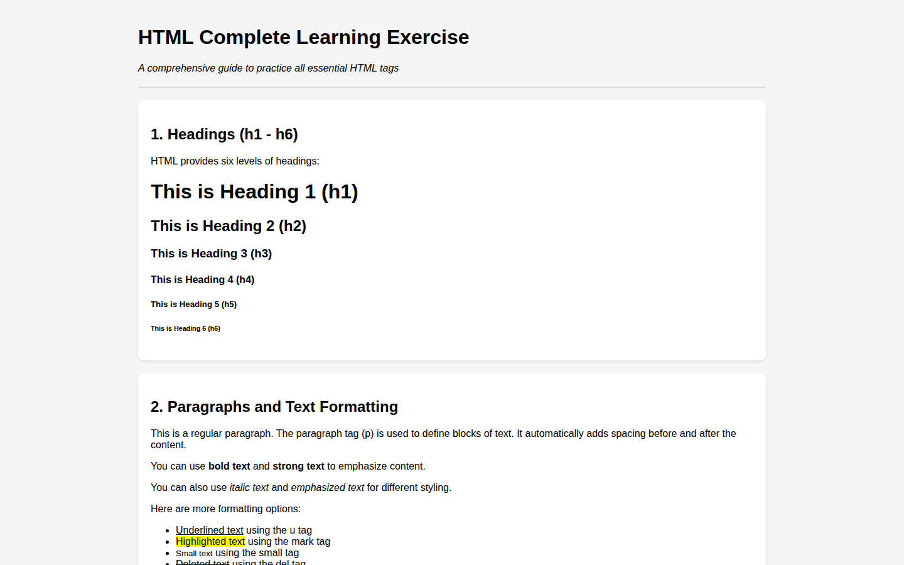

# HTML Complete Learning Exercise

A reference page for students that demonstrates the main HTML elements, section by section.

## What's inside

- Headings, paragraphs, and text formatting
- Lists and tables
- Forms and input elements
- Links, images, and media
- Semantic HTML elements

## Built with

- HTML
- CSS

## Run locally

No build step. Open `index.html` in a browser.
